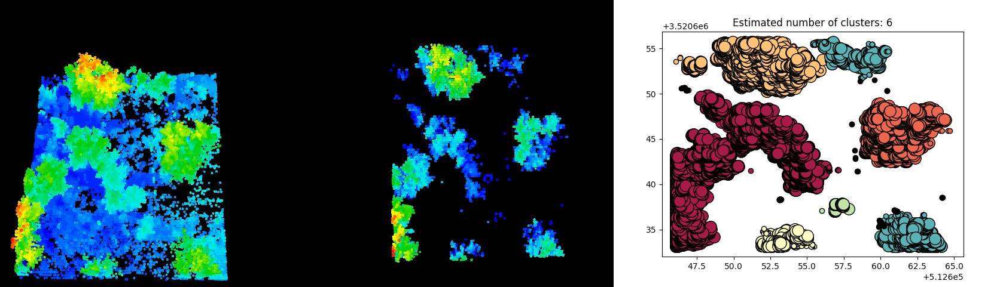
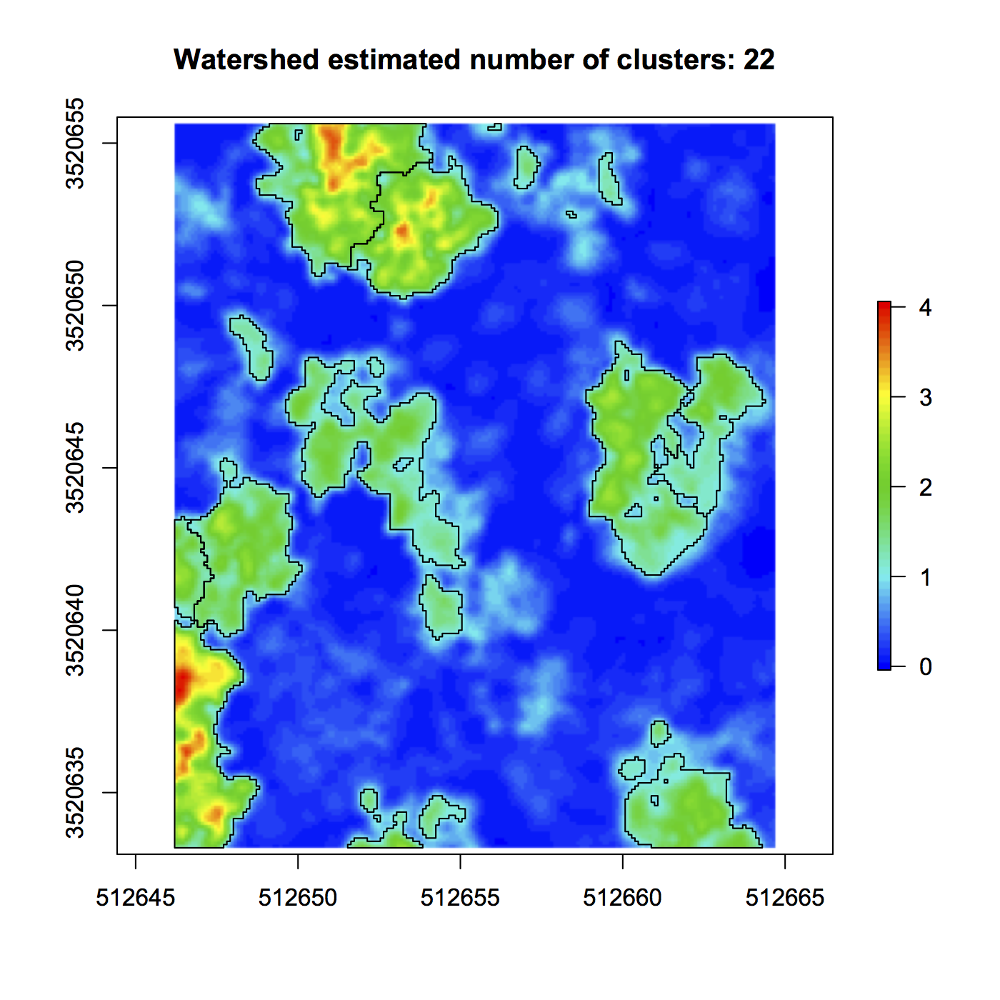
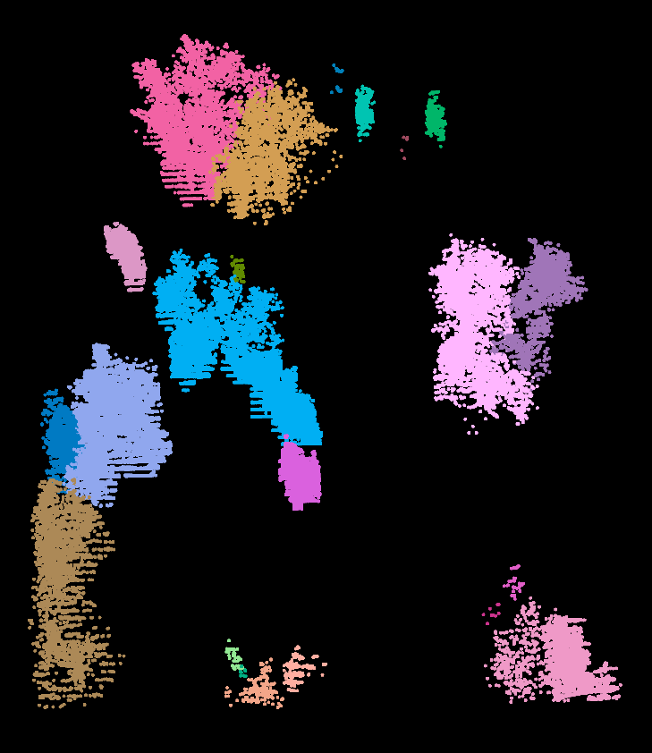

# Point Cloud Canopy Segmentation

OPTICS/DBSCAN point cloud canopy cluster:

Normalized point cloud >> Nonground points (> 1m HAG) >> Vegetation clusters (clustered using OPTICS)

Watershed method clusters:

^^Tends to over-segment in shrubby environment

